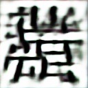
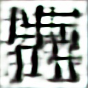
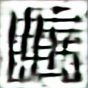
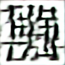

# Custom Kanji Generator

## Description

This little code allows you to generate random kanjis for fun.
You can create and improve your own IA with it or even custom this program to make your own things...

## Pictures

As you can see on this exemple, the AI I trained made some blury Kanjis ?






## Download

You can get the code with git or with a .Zip

```sh
$ git clone git@github.com:Taliayaya/GAN-Kanji-creator.git
```

or

```sh
$ git clone https://github.com/Taliayaya/GAN-Kanji-creator.git
```

Next you will have to install dependencies if needed

```
$ make deps
```

Finally, [Download the dataset](https://www.kaggle.com/datasets/frammie/kanjieast-asian-characters) used and extract it in the root of this project.

> NB: If you are creating your own images, you have to create a folder called /doss to receive the images. (or modify the name in the code)

You should be able to play this little program. Enjoy

## Use your AI

After executing the main file, you will train and AI with 60 iterations and 500 demi batch. You can change the constants to get the best AI possible.

You should end up with two files : GEN.h5 and DISC.h5 : Your generator and discriminator. The file used in create.py to generate your images is GEN.h5. DISC.h5 can be used to load and continue training your discriminator.
